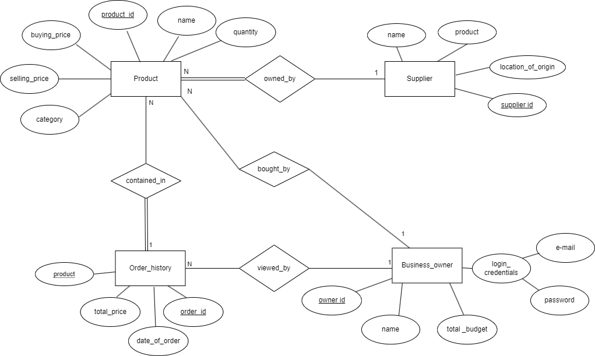

# Backend and Frontend Template

Latest version: https://git.chalmers.se/courses/dit342/group-00-web

This template refers to itself as `group-00-web`. In your project, use your group number in place of `00`.

## Project Structure

| File        | Purpose           | What you do?  |
| ------------- | ------------- | ----- |
| `server/` | Backend server code | All your server code |
| [server/README.md](server/README.md) | Everything about the server | **READ ME** carefully! |
| `client/` | Frontend client code | All your client code |
| [client/README.md](client/README.md) | Everything about the client | **READ ME** carefully! |
| [docs/LOCAL_DEPLOYMENT.md](docs/LOCAL_DEPLOYMENT.md) | Local production deployment | Deploy your app local in production mode |

## Requirements

The version numbers in brackets indicate the tested versions but feel free to use more recent versions.
You can also use alternative tools if you know how to configure them (e.g., Firefox instead of Chrome).

* [Git](https://git-scm.com/) (v2) => [installation instructions](https://www.atlassian.com/git/tutorials/install-git)
  * [Add your Git username and set your email](https://docs.gitlab.com/ce/gitlab-basics/start-using-git.html#add-your-git-username-and-set-your-email)
    * `git config --global user.name "YOUR_USERNAME"` => check `git config --global user.name`
    * `git config --global user.email "email@example.com"` => check `git config --global user.email`
  * > **Windows users**: We recommend to use the [Git Bash](https://www.atlassian.com/git/tutorials/git-bash) shell from your Git installation or the Bash shell from the [Windows Subsystem for Linux](https://docs.microsoft.com/en-us/windows/wsl/install-win10) to run all shell commands for this project.
* [Chalmers GitLab](https://git.chalmers.se/) => Login with your **Chalmers CID** choosing "Sign in with" **Chalmers Login**. (contact [support@chalmers.se](mailto:support@chalmers.se) if you don't have one)
  * DIT342 course group: https://git.chalmers.se/courses/dit342
  * [Setup SSH key with Gitlab](https://docs.gitlab.com/ee/ssh/)
    * Create an SSH key pair `ssh-keygen -t ed25519 -C "email@example.com"` (skip if you already have one)
    * Add your public SSH key to your Gitlab profile under https://git.chalmers.se/profile/keys
    * Make sure the email you use to commit is registered under https://git.chalmers.se/profile/emails
  * Checkout the [Backend-Frontend](https://git.chalmers.se/courses/dit342/group-00-web) template `git clone git@git.chalmers.se:courses/dit342/group-00-web.git`
* [Server Requirements](./server/README.md#Requirements)
* [Client Requirements](./client/README.md#Requirements)

## Getting started

```bash
# Clone repository
git clone git@git.chalmers.se:courses/dit342/group-00-web.git

# Change into the directory
cd group-00-web

# Setup backend
cd server && npm install
npm run dev

# Setup frontend
cd client && npm install
npm run serve
```

> Check out the detailed instructions for [backend](./server/README.md) and [frontend](./client/README.md).

## Visual Studio Code (VSCode)

Open the `server` and `client` in separate VSCode workspaces or open the combined [backend-frontend.code-workspace](./backend-frontend.code-workspace). Otherwise, workspace-specific settings don't work properly.

## System Definition (MS0)

### Purpose

Our system is an inventory mangement system that can be used by organisations like: grocery stores, fashion brands, and electronic stores. The main idea behind our system is to help these organisation keep track of all of their inventory (what all products they have in stock), and for these organisations to be directly connected to the suppliers who provide them with their inventory.

Our system will allow for inventory to be displayed and to be sorted based on various different attributes like: price and quantity. Our system will also be able to list suppliers and all the products that each supplier sells as well as order from the suppliers. It will also allow business owners to change their basic information like the name, email and password as well as update their budget. 

Finally, the system will be able to access their order histories as well as delete all the order histories.


### Pages

* Home: The home page displays important statistics about the business, like the total cost of their inventory, or about products that are almost running out of stock, or how much products they have in their basket.
* Suppliers: The suppliers page can have a list of suppliers and it displays important information about the supplier as well as their products in where the business owner can buy their products from.
* Products: A page that contains a list of all the products owned by the business owner. It will also consist of important attributes of these products like their quantity, buying price and selling price. Business Owners can also update the product info to sync with what they have sold in their physical store.
* Settings: A page that allows the user to change their passwords, email and username. It also allows the user to update their budget based on what their current budget is.


### Entity-Relationship (ER) Diagram



## Teaser (MS3)


## API Proposal

**NOTE (October 21): We have decided to not implement the API Proposal due to the lack of resources we had in order to implement the API before the project's deadline.**

We are thinking of implementing the Currency Exchange API. This will allow each business owner to see their relevant price based on their geolocation. This ensures that the business owner is able to understand the value of his product and adjust precisely on how much of his local currency he would like to spend.

Pages such as the Products Page, Inventory page, and the Setting page will be able to implement this feature by adding a “preferred currency” for the business owners and supplier entities, such that whenever a business owner accesses a supplier product regardless of which currency the use it will convert the currency to the preferred currency that was chosen by the business owner.

Frontend: We will have a new attribute called preferred currency which the business owner can select. This will highlight to the user if he would like to display the prices in USD (international currency) or in their local currency. When applicable, the user will be able to see the prices of all the other products from foreign suppliers converted to their preferred currency value.

Backend: The implementation of this API in the backend will involve adding new attributes to the business owner entity (country of origin and preferred currency). We will also need to do advanced filtering such that when we get a list of products, all the price-related attributes need to be converted to the preferred currency of the business owner.


Link for the Currency Exchange API: https://www.exchangerate-api.com/